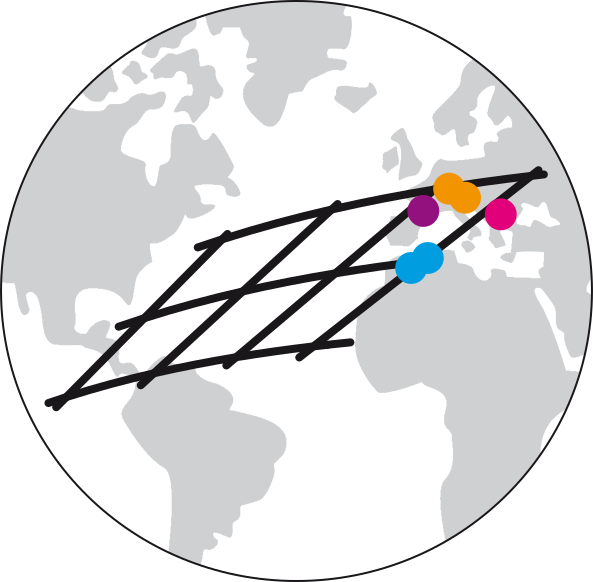

<!-- README.md is generated from README.Rmd. Please edit that file -->

```{r, include = FALSE}
knitr::opts_chunk$set(
  collapse = TRUE,
  comment = "#>",
  fig.path = "man/figures/README-",
  out.width = "100%"
)
library(ggplot2)
library(dplyr)
library(readr)
library(icons)

if (!"tmap" %in% installed.packages()) {install.packages("tmap")}


```

<!-- badges: start -->
[](https://creativecommons.org/licenses/by/4.0/)
[](https://github.com/archmetalDBM/GlobaLID-database)
[](https://doi.org/10.5880/fidgeo.2023.043)
<!-- badges: end -->


# GlobaLID database 

Here you can find the most recent version of the GlobaLID database and the R-scripts we use to calculate any lead isotope ratios missing in the original publications and the age model parameters. What you see here is work in progress, there might still be some errors or blanks in the data. Database versions with only correct and complete data (to the best of our knowledge) are regularly archived at the [GFZ data repository](https://doi.org/10.5880/fidgeo.2021.031). These are the versions that should be used.  

# What is GlobaLID? 
GlobaLID is a Global Lead Isotope Database and aims to facilitate the reconstruction of raw material provenances with lead isotopes, especially in archaeology. The app provides direct access to and convenient interaction with the [GlobaLID database](https://doi.org/10.5880/fidgeo.2021.031). You can filter the database according to your research question, upload own data to compare it with GlobaLID, and produce and download publication ready plots. Visit [our webpage](https://archmetaldbm.github.io/Globalid/) to learn more about the GlobaLID project and to get the latest news. 

The current version of the GlobaLID database includes data from these locations: 
```{r map, echo=FALSE, fig.width=10}

data("World", package = "tmap") # load worldmap from package tmap

GlobaLID <- readr::read_csv("GlobaLID.csv", guess_max = 22000, col_types = readr::cols(), trim_ws = TRUE) %>%
  select(Longitude, Latitude)

ggplot() + 
  geom_sf(data = World, fill = "white", size = .25) +
  geom_point(data = GlobaLID, aes(x = Longitude, y = Latitude), size = 0.25, color = "red", shape = 16, alpha = 0.75) +
  scale_x_continuous(expand = c(0,0)) + 
  scale_y_continuous(expand = c(0,0)) +
  theme_void() + 
  theme(panel.background = element_rect(fill = alpha("darkblue", 0.1), color = NA), 
        legend.box.background = element_rect(fill = "white", color = NA))
```


# How to cite
If you use the GlobaLID database, please cite it as  

* Westner, Katrin J.; Rose, Thomas; Klein, Sabine; Hsu, Yiu-Kang (2021): GlobaLID – Global Lead Isotope Database. V. 1.0. GFZ Data Services. [https://doi.org/10.5880/fidgeo.2021.031](https://doi.org/10.5880/fidgeo.2021.031)
* Klein, S., Rose, T., Westner, K. J., & Hsu, Y.-K. (2022). From OXALID to GlobaLID: Introducing a modern and FAIR lead isotope database with an interactive application. Archaeometry 64(4), 935--950. [https://doi.org/10.1111/arcm.12762](https://doi.org/10.1111/arcm.12762)

```
@misc{Westner.2021,
 author = {Westner, Katrin J. and Rose, Thomas and Klein, Sabine and Hsu, Yiu-Kang},
 year = {2021},
 title = {{GlobaLID -- Global Lead Isotope Database V. 1.1}},
 publisher = {{GFZ Data Services}},
 doi = {10.5880/fidgeo.2021.031}, 
 url = {https://doi.org/10.5880/fidgeo.2023.043}
}

@article{Klein.2022,
author = {Klein, Sabine and Rose, Thomas and Westner, Katrin J. and Hsu, Yiu-Kang},
title = {From OXALID to GlobaLID: Introducing a modern and FAIR lead isotope database with an interactive application},
journal = {Archaeometry},
volume = {64},
number = {4},
pages = {935-950},
doi = {https://doi.org/10.1111/arcm.12762},
}
```

# Become a contributor! 
GlobaLID needs your help to grow and to provide high quality datasets! The core team is permanently reviewing and adding new and old data from the literature to keep GlobaLID growing. However, we are neither proficient enough with the geology and geography of all parts of the world nor do we know all publications with lead isotope data from ores and minerals. Hence we are happy about any support from our community. Interested? Write us! 

# Join the team! 
GlobaLID needs your help to grow and to provide high quality datasets! The core team is permanently reviewing and adding new and old data from the literature to keep GlobaLID growing. However, we are neither proficient enough with the geology and geography of all parts of the world nor do we know all publications with lead isotope data from ores and minerals. Hence we are happy about any support from our community. Interested? Write us! 

# Team 

## Core team

* Coordination: [Sabine Klein](https://www.bergbaumuseum.de/en/museum/mitarbeitende/kontakt-detailseite/prof-dr-sabine-klein) [](https://orcid.org/0000-0002-3939-4428) (Forschungsbereich Archäometallurgie, Leibniz-Forschungsmuseum für Georessourcen/Deutsches Bergbau-Museum Bochum, Bochum, Germany; Institut für Archäologische Wissenschaften, Ruhr-Universität Bochum, Bochum, Germany; FIERCE, Frankfurt Isotope & Element Research Centre, Goethe Universität, Frankfurt am Main, Germany)
* Programming: [Thomas Rose](https://copper-smelting.com/) [](https://orcid.org/0000-0002-8186-3566) (Goethe-Universität Frankfurt, Institut für Geowissenschaften, Frankfurt, Germany; Forschungsbereich Archäometallurgie, Leibniz-Forschungsmuseum für Georessourcen/Deutsches Bergbau-Museum Bochum, Bochum, Germany)
* Database: [Katrin J. Westner](http://lgltpe.ens-lyon.fr/annuaire/westner-katrin) [](https://orcid.org/0000-0001-5529-1165) (Forschungsbereich Archäometallurgie, Leibniz-Forschungsmuseum für Georessourcen/Deutsches Bergbau-Museum Bochum, Bochum, Germany)
* Metadata: [Yiu-Kang Hsu](https://www.bergbaumuseum.de/en/museum/mitarbeitende/kontakt-detailseite/yiu-kang-hsu) [](https://orcid.org/0000-0002-2439-4863) (Forschungsbereich Archäometallurgie, Leibniz-Forschungsmuseum für Georessourcen/Deutsches Bergbau-Museum Bochum, Bochum, Germany)

## Regional editors

* Southeast Asia: [T. O. Pryce](https://iramat.cnrs.fr/user/oliver.pryce/) [](https://orcid.org/0000-0002-7290-141X) (Centre National de la Recherche Scientifique, UMR 7065 Institut de Recherche sur les ArchéoMATériaux, Université Paris-Saclay & CEA/CNRS UMR 3685 NIMBE, 91191 Gif-sur-Yvette, France)
* Africa: [Jay Stephens](https://archaeometry.missouri.edu/staff.html) [](https://orcid.org/0000-0003-1299-3946) (School of Anthropology, University of Arizona, Tucson, AZ, USA; Archaeometry Laboratory, Research Reactor Center, University of Missouri, Columbia, MO, USA)
* Iran: [Nima Nezafati](https://www.bergbaumuseum.de/en/museum/mitarbeitende/kontakt-detailseite/dr-nima-nezafati) [](https://orcid.org/0000-0002-5806-343X) (Forschungsbereich Archäometallurgie, Leibniz-Forschungsmuseum für  Georessourcen/Deutsches Bergbau-Museum Bochum, Bochum, Germany)
* North America: 
  * [Virginie Renson](https://archaeometry.missouri.edu/profile(Virginie).html) [](https://orcid.org/0000-0002-5701-0985) (Archaeometry Laboratory, Research Reactor Center, University of Missouri, Columbia, MO, USA)
  * [David Killick](https://anthropology.arizona.edu/people/dave-killick) [](https://orcid.org/0000-0002-8964-750X) (School of Anthropology, University of Arizona, Tucson, AZ, USA)
* South America: [María Florencia Becerra](https://www.conicet.gov.ar/new_scp/detalle.php?id=29835) [](https://orcid.org/0000-0001-6302-7452) (CONICET (Consejo Nacional de Investigaciones Científicas  y Técnicas) - División Arqueología, Museo de La Plata, Facultad de Ciencias Naturales y Museo, Universidad Nacional de La Plata, Argentina)

## Contributors (Data)
* Sabine Fischer-Lechner (Forschungsbereich Archäometallurgie, Leibniz-Forschungsmuseum für Georessourcen/Deutsches Bergbau-Museum Bochum, Bochum, Germany)

## Contributors (Programming)

* Daniel Finn [](https://orcid.org/0009-0000-0953-0006) (Institute of Archaeology, The Hebrew University of Jerusalem, Jerusalem, Israel)

# Acknowledgements

The initial GlobaLID database was compiled during years of own research and profited from the generous sharing of published lead isotope datasets by many colleagues. The creative and collective work of compiling the database and application was initiated when all members of the Core Team and E. Salzmann were members of the Archaeometallurgy group at the Deutsches Bergbau-Museum (DBM). H. Zietsch (DBM) compiled the initial literature references. 

The Core Team feels deeply grateful for the support of the contributors. Without their efforts, GlobaLID would grow much slower and less accurate. 

We are indebted to the R Core Team for providing and maintaining [R](https://cran.r-project.org/), the authors of the fantastic packages we use, and the R community on [stackoverflow](https://stackoverflow.com/) and many other webpages. Last but definitely not least we are grateful to the [OpenStreetMap contributors](https://www.openstreetmap.org) from whose Nominatim database we obtain most of the the geographical meta-information. 

The following R packages are used on a regular basis: 

* [dplyr](https://dplyr.tidyverse.org/)
* [readr](https://readr.tidyverse.org/)
* [rootSolve](https://cran.r-project.org/web/packages/rootSolve/index.html)
* [stringr](https://stringr.tidyverse.org/)
* [tidygeocoder](https://github.com/jessecambon/tidygeocoder)
* [tidyr](https://tidyr.tidyverse.org/)