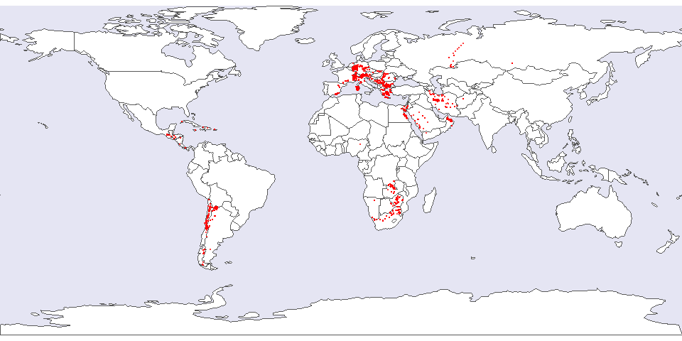

<!-- README.md is generated from README.Rmd. Please edit that file -->
<!-- badges: start -->

<!-- badges: end -->

# GlobaLID database 

Here you can find the most recent version of the GlobaLID database and
the R-scripts we use to calculate any lead isotope ratios missing in the
original publications and the age model parameters. What you see here is
work in progress, there might still be some errors or blanks in the
data. Database versions with only correct and complete data (to the best
of our knowledge) are regularly archived at the [GFZ data
repository](https://doi.org/10.5880/fidgeo.2021.031). These are the
versions that should be used.

# What is GlobaLID?

GlobaLID is a Global Lead Isotope Database and aims to facilitate the
reconstruction of raw material provenances with lead isotopes,
especially in archaeology. The app provides direct access to and
convenient interaction with the [GlobaLID
database](https://doi.org/10.5880/fidgeo.2021.031). You can filter the
database according to your research question, upload own data to compare
it with GlobaLID, and produce and download publication ready plots.

The current version of the GlobaLID database includes data from these
locations: 

# How to cite

If you use the GlobaLID database, please cite it as  
Westner, Katrin J.; Rose, Thomas; Klein, Sabine; Hsu, Yiu-Kang (2021):
GlobaLID – Global Lead Isotope Database. V. 1.0. GFZ Data Services.
<https://doi.org/10.5880/fidgeo.2021.031>

    @misc{Westner.2021,
     author = {Westner, Katrin J. and Rose, Thomas and Klein, Sabine and Hsu, Yiu-Kang},
     year = {2021},
     title = {{GlobaLID -- Global Lead Isotope Database V. 1.0}},
     publisher = {{GFZ Data Services}},
     doi = {10.5880/fidgeo.2021.031}, 
     url = {https://doi.org/10.5880/fidgeo.2021.031}
    }

# Become a contributor!

GlobaLID needs your help to grow and to provide high quality datasets!
The core team is permanently reviewing and adding new and old data from
the literature to keep GlobaLID growing. However, we are neither
proficient enough with the geology and geography of all parts of the
world nor do we know all publications with lead isotope data from ores
and minerals. Hence we are happy about any support from our community.
Interested? Write us!

# GlobaLID core team

-   Coordinator: [Sabine
    Klein](https://www.bergbaumuseum.de/en/museum/mitarbeitende/kontakt-detailseite/prof-dr-sabine-klein)
    
    (Forschungsbereich Archäometallurgie, Leibniz-Forschungsmuseum für
    Georessourcen/Deutsches Bergbau-Museum Bochum, Bochum, Germany;
    Institut für Archäologische Wissenschaften, Ruhr-Universität Bochum,
    Bochum, Germany; FIERCE, Frankfurt Isotope & Element Research
    Centre, Goethe Universität, Frankfurt am Main, Germany)
-   Database: [Katrin J.
    Westner](http://lgltpe.ens-lyon.fr/annuaire/westner-katrin)
    
    (Ecole Normale Supérieure de Lyon, CNRS, Université de Lyon, Lyon,
    France)
-   Programming: Thomas Rose
    
    (Department of Archaeology, Ben-Gurion University of the Negev,
    Be’er Sheva, Israel; Department of Antiquity, Sapienza University of
    Rome, Rome, Italy)
-   East Asia: [Yiu-Kang
    Hsu](https://www.bergbaumuseum.de/en/museum/mitarbeitende/kontakt-detailseite/yiu-kang-hsu)
    
    (Forschungsbereich Archäometallurgie, Leibniz-Forschungsmuseum für
    Georessourcen/Deutsches Bergbau-Museum Bochum, Bochum, Germany)

# Contributors

-   [Nima
    Nezafati](https://www.bergbaumuseum.de/en/museum/mitarbeitende/kontakt-detailseite/dr-nima-nezafati)
    
    (Forschungsbereich Archäometallurgie, Leibniz-Forschungsmuseum für
    Georessourcen/Deutsches Bergbau-Museum Bochum, Bochum, Germany)
-   Markos Vaxevanopoulos
    
    (École Normale Supérieure de Lyon, Laboratoire de Géologie de Lyon:
    Terre, Planète, Environnement, Lyon, France)

# Acknowledgements

The initial GlobaLID database was compiled during years of own research
and profited from the generous sharing of published lead isotope
datasets by many colleagues. The creative and collective work of
compiling the database and application was initiated when all members of
the Core Team and E. Salzmann were members of the Archaeometallurgy
group at the Deutsches Bergbau-Museum (DBM). H. Zietsch (DBM) compiled
the initial literature references.

The Core Team feels deeply grateful for the support of the contributors.
Without their efforts, GlobaLID would grow much slower and less
accurate.

We are indebted to the R Core Team for providing and maintaining
[R](https://cran.r-project.org/), the authors of the fantastic packages
we use, and the R community on
[stackoverflow](https://stackoverflow.com/) and many other webpages.
Last but definitely not least we are grateful to the [OpenStreetMap
contributors](https://www.openstreetmap.org) from whose Nominatim
database we obtain most of the the geographical meta-information.

The following R packages are used on a regular basis:

-   [dplyr](https://dplyr.tidyverse.org/)
-   [readr](https://readr.tidyverse.org/)
-   [rootSolve](https://cran.r-project.org/web/packages/rootSolve/index.html)
-   [stringr](https://stringr.tidyverse.org/)
-   [tidygeocoder](https://github.com/jessecambon/tidygeocoder)
-   [tidyr](https://tidyr.tidyverse.org/)
